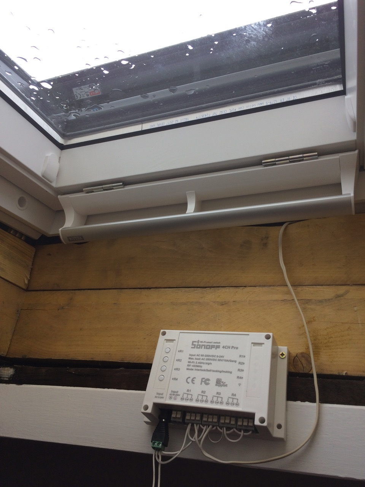
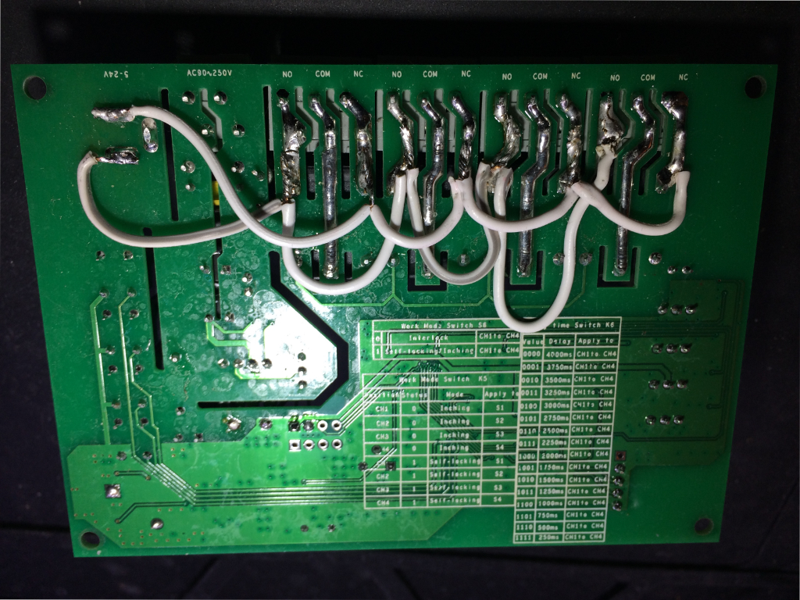
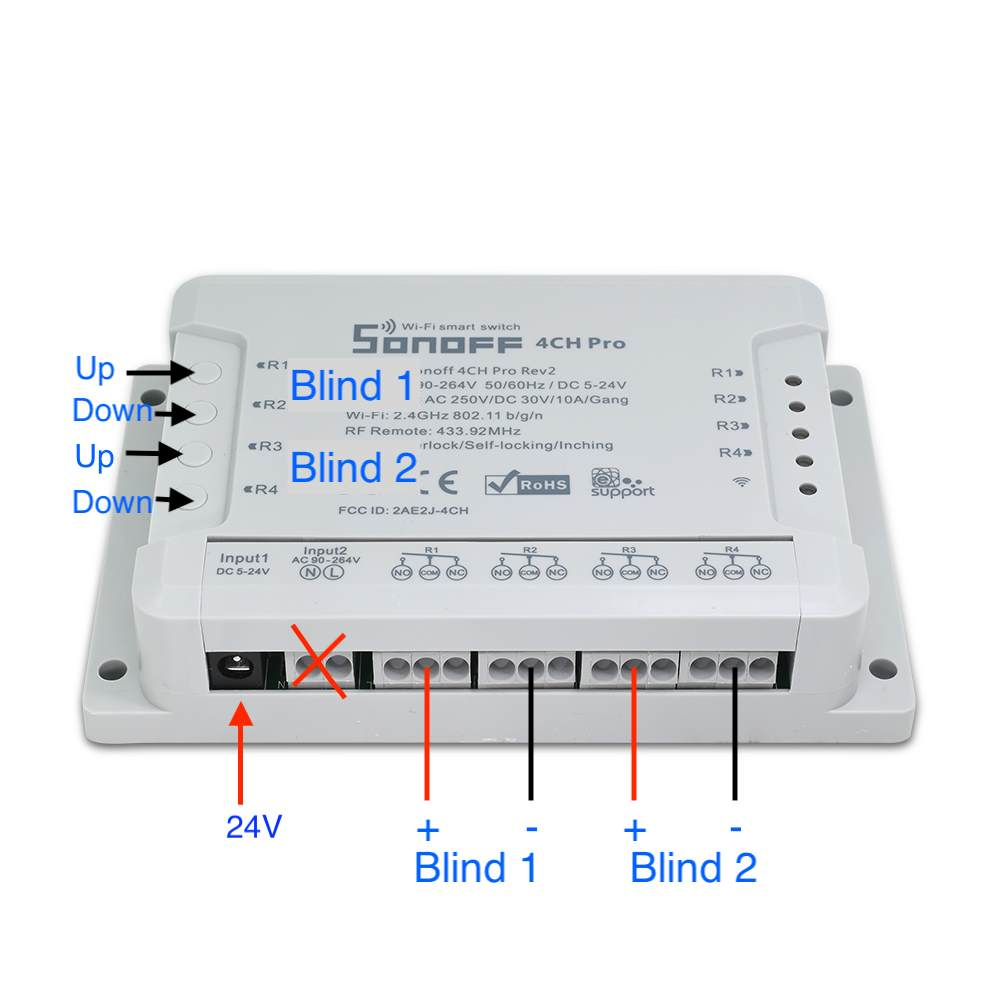

[](https://www.repostatus.org/#active)

Status as of 2022-07-06: Still working and in use daily.

# How to control Velux electric rolling shutters with Home Assistant and without Velux hardware


Works with Velux SML roller blinds. Conversion from SSL blinds possible, see below.

## Official Velux hardware

I'm getting my roof repaired and my Velux windows renovated and I opted to get some [electric rolling shutters](https://www.velux.co.uk/products/blinds-and-shutters/roller-shutters) (ref: Velux SML) to replace my indoor rolling blinds. I didn't need to get them solar powered as they are close to a power outlet.

I was looking into integration into my [Home Assistant](https://home-assistant.io) setup and found out that it requires:

 * a Velux KUX 110 per window (80€). They include a power supply and a radio remote. This is the module that powers and control the motor.
 * a Velux KLF 200 (200€). This can control up to 5 individual windows via a touch screen or an API. Talks via radio to the KUX 110. It has a [Home Assistant component](https://home-assistant.io/components/velux/).

The [IO homecontrol](protocol) it uses is very proprietary and the radio protocol hasn't been reverse engineered yet.

But then I found out that the motor control is [trivial (article in french but schematics should be understandable by anyone)](http://www.planete-domotique.com/blog/2013/08/29/comment-piloter-ses-volets-roulants-velux/). The blinds simply have two wires, if +24V is provided, the blinds will go up, stopping by themselves once they reach the top (the end stop is integrated) and -24V will makes them go down, once again they stop by themselves. 0V will obviously make them stop.

They do need to be powered for a while before reacting. Don't worry if it takes tens of minutes to start to move the first time. It's instantaneous afterwards.

This might also work with similar rolling shutters/blinds from other manufacturers that uses the same principle.

### ❗ Important Note

Apparently, once a Velux SML has been used with a KUX unit it changes mode of operation and cannot be used with the following method.

[Here is more information and a possible way to factory reset them](https://smarthome.exposed/controlling-velux-windows/).

## Sonoff 4CH Pro hardware

This piece of hardware, the [Sonoff 4CH Pro](http://sonoff.itead.cc/en/products/sonoff/sonoff-4ch-pro) is ideal for this: It provides 4 relays, can be powered with 24V and has Wifi thanks to the [ESP8266](https://en.wikipedia.org/wiki/ESP8266). It also has holes to solder a header to re-flash the chip and use a firmware more compatible with Home assistant, but more on that later.

Unlike other Sonoff devices, the relays are not tied to AC. As it can be powered by the same voltage we need to power the motors, it'll need only one power supply for this.

The four relays means that I can control two motors in two different directions.

It can be DIN-rail mounted and it also has mounting holes. It has 4 buttons to control the covers manually and has an optional RF remote available (not tested).

The power supply is not provided and I used a 24V 6A PSU. Apparently only 1A is needed per shutter motor so a 3A PSU should be more than enough to power 2 motors and the electronics.

### Price

  * Sonoff 4CH Pro: 25€
  * PSU: 15€

### Wiring

The cabling is simple. For all four relays, each of them has their NO (Normally Open) connector provided with the 24V from the power supply. All NC (Normally Closed) are tied to ground and the motors uses the COM (Common) holes. If the motor goes the opposite direction of what is requested, just invert the motor cables.

### Test installation 



For my usage, I've internally soldered some cables to chain the NO and NC terminals together and tie them to the power supply input.

### Internal wiring



The exterior is unmodified so I've also sealed the AC inputs to make sure nothing gets plugged in there by mistake.

If relay 1 is activated, the motor will get 24V and the blind will go up. If relay 2 is activated, it'll get -24V and go down. If both relay 1 and 2 are activated or off, the motor will get 0V and do nothing.

So far, so good, but it still needs to be integrated into Home Assistant. For that we'll use Esphome.



## Esphome firmware

[ESPHome](https://esphome.io):

> ESPHome is a system to control your ESP8266/ESP32 by simple yet powerful configuration files and control them remotely through Home Automation systems.

I've provided a pre configured configuration file `velux.yaml`. 
It'll expose 2 blinds entities, a light entity for the blue led and the buttons on the device will open/close the blinds.

You'll need to add a `secret.yaml` file with your wifi SSID and password:

```yaml
wifi_ssid: your_ssid
wifi_password: your_password
```

You'll also probably want to edit the `velux.yaml` file and change the name of the blinds.

Run `esphome compile velux.yaml` and the firmware will be available at `.esphome/build/sonoff4chpro/.pioenvs/sonoff4chpro/firmware.bin`.

### Flashing

⚠️  NEVER CONNECT AC TO THE DEVICE.
It's not needed for this usage and is dangerous.

This is the hard part, it's very finicky. Fortunately, it only needs to be done once as OTA updates can be used afterward.

Here is the documentation for putting the 4CH Pro in flashing mode: [Tasmota documentation](https://tasmota.github.io/docs/devices/Sonoff-4CH-Pro/#sonoff-4ch-pro-r3). It contains informations about the three different revisions of the hardware.

Now follow the uploading firmware steps of the [esphome documentation](https://esphome.io/devices/sonoff_4ch.html#step-4-uploading-firmware).

This was by far the most difficult step. It took me a lot of tries to get it right but it eventually worked.

## Home Assistant configuration

The device will be detected automatically and be available for setup in the "Integrations" pages.


## Addendum: Conversion for Velux Solar Blinds (SSL) to 24V (SML)

Thanks to [KayGundhardt](https://github.com/KayGundhardt) for this experimentation and guide.

 - Buy a SML replacement motor like [this](https://www.dach-shop24.de/velux-rollladenmotor/p-48430.html).
 - Remove ENTIRE SSL unit (the pod).
 - From inside the pod: remove the control-board, battery and finally the motor.
 - ⚠️ PAY ATTENTION: the 2 small torx (#8) screws that holds the motor in the pod are also DIRECTLY holding the inner case for the motor gear wheels!! So open them CAREFULLY in a horizontal position and put them immediately back in place when you removed the motor out of the pod!
 - Insert SML replacement motor into the empty SSL unit pod.
 - Connect to the Sonoff and press the button to make it go up or down, wait for a while for it to react and reach the end. Press the other button to make it go the opposite direction.
 
 Be patient, it can take a while to starts moving, this is normal.
